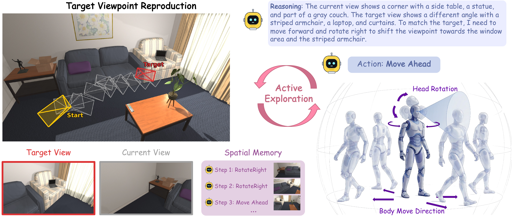

<h1 align="center">Where to Look: Can Foundation Models Reach a Target Viewpoint Through Active Exploration?</h1>

<p align="center">
<b>Liyang Li<sup>*</sup>, Muzhi Zhu<sup>*</sup>, Zhiyue Zhao, Hengyu Zhao, Ke Liu, Linhao Zhong, Hao Chen, Chunhua Shen<sup>&dagger;</sup></b>
<br>
Zhejiang University
<br>
<sup>*</sup>Equal contribution &nbsp; <sup>&dagger;</sup>Corresponding author
</p>

<p align="center">
<a href="https://arxiv.org/abs/2606.01247" target="_blank"></a>&nbsp;
<a href="https://huggingface.co/papers/2606.01247" target="_blank"></a>&nbsp;
<a href="https://huggingface.co/TVRBench/tvr-qwen3.5-9b-va-sft-rl" target="_blank"></a>&nbsp;
<a href="https://huggingface.co/datasets/TVRBench/tvr-sft-va" target="_blank"></a>
</p>

<p align="center">

</p>

## Overview

**Target Viewpoint Reproduction (TVR)** is a closed-loop active perception task: the agent receives a target image and an initial observation in a 3D indoor environment, then acts (translate, rotate, adjust head pitch) until its observation matches the target viewpoint.

TVRBench is an indoor-simulation benchmark built on [AI2-THOR](https://ai2thor.allenai.org/), covering single-room (iTHOR) and multi-room (ProcTHOR) scenes with diagnostics for exploration efficiency, spatial memory, and perception-to-action mapping.

## Installation

```bash
conda create -n tvrbench python=3.10 -y
conda activate tvrbench
pip install -r requirements.txt

# Vulkan driver (Linux, required for AI2-THOR CloudRendering)
apt-get -y install libvulkan1 vulkan-tools
```

## Data

Benchmark data is included in the repo:

```
data/
├── scene_splits.json              # scene split assignments (SFT / Eval / RL)
├── procthor-10k/                  # ProcTHOR house definitions
│   ├── train.jsonl.gz
│   ├── val.jsonl.gz
│   └── test.jsonl.gz
└── tasks/
    ├── sft.json                   # 1,600 SFT tasks (40 scenes)
    ├── eval.json                  # 500 eval tasks (80 scenes)
    └── rl.json                    # 4,800 RL tasks (120 scenes)
```

6,900 tasks across 240 scenes (120 iTHOR + 120 ProcTHOR), split into 4 difficulty categories:

| Category | Visual Complexity | Navigation |
|----------|------------------|------------|
| iTHOR easy (SR-easy) | high (seg >= 9) | short (2–8 steps) |
| iTHOR hard (SR-hard) | low (seg 3–6) | short (2–8 steps) |
| ProcTHOR easy (LR-easy) | high (seg >= 9) | cross-room (10–20 steps) |
| ProcTHOR hard (LR-hard) | low (seg 3–6) | cross-room (10–20 steps) |

## Models & Datasets

Available on [HuggingFace](https://huggingface.co/TVRBench):

| Resource | Link | Description |
|----------|------|-------------|
| TVR-Qwen3.5-9B-VA-SFT-RL | [Model](https://huggingface.co/TVRBench/tvr-qwen3.5-9b-va-sft-rl) | Best model (51.4% SR) — VA-SFT + Online GRPO |
| TVR-SFT-VA | [Dataset](https://huggingface.co/datasets/TVRBench/tvr-sft-va) | Visual-Action SFT data (1,600 trajectories) |
| TVR-SFT-VA-CoT | [Dataset](https://huggingface.co/datasets/TVRBench/tvr-sft-va-cot) | VA-SFT with Chain-of-Thought reasoning |

## Evaluation

### 1. Start vLLM Server

```bash
conda activate vllm

CUDA_VISIBLE_DEVICES=0,1 vllm serve TVRBench/tvr-qwen3.5-9b-va-sft-rl \
    --tensor-parallel-size 2 --max-model-len 16384 \
    --trust-remote-code
```

### 2. Run Evaluation

```bash
conda activate tvrbench

PYTHONPATH=. python scripts/eval_va.py \
    --model_name TVRBench/tvr-qwen3.5-9b-va-sft-rl \
    --api_base http://localhost:8000/v1 \
    --task_file data/tasks/eval.json \
    --output_dir outputs/eval_results \
    --temperature 0.0 \
    --gpu_ids 2 3 --procs_per_gpu 5 \
    --resume
```

- `--gpu_ids`: GPUs for AI2-THOR rendering (separate from vLLM GPUs)
- `--procs_per_gpu`: parallel evaluation workers per GPU
- `--resume`: skip completed tasks

## Training

### SFT with LLaMA-Factory

Tested with [LLaMA-Factory](https://github.com/hiyouga/LLaMA-Factory) v0.9.5. Download SFT data from [HuggingFace](https://huggingface.co/datasets/TVRBench/tvr-sft-va), then update paths in `configs/train_va_sft.yaml`:

```bash
pip install -e LLaMA-Factory
llamafactory-cli train configs/train_va_sft.yaml
```

### Online RL with verl

Tested with [verl](https://github.com/volcengine/verl) v0.8.0.

```bash
MODEL_PATH=/path/to/va-sft-checkpoint \
bash scripts/run_online_rl.sh full
```

See `configs/online_rl/` for RL training configuration.

## License

This project is licensed under the [Apache License 2.0](LICENSE).

## Acknowledgments

This project uses [AI2-THOR](https://ai2thor.allenai.org/), [LLaMA-Factory](https://github.com/hiyouga/LLaMA-Factory), [verl](https://github.com/volcengine/verl), and [vLLM](https://github.com/vllm-project/vllm).
